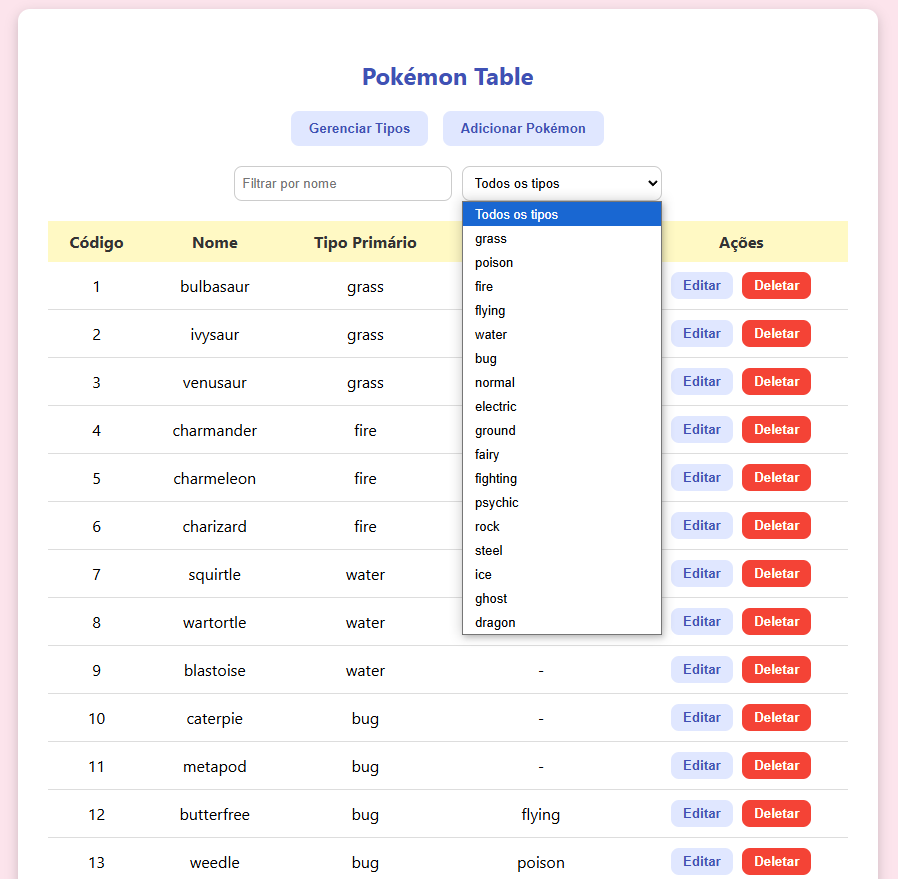

# Pokédex

Aplicativo utilizado para catalogar pokémons.


## Funcionalidades

- Listagem de Pokémons;
- Listagem por tipo de Pokémon;
- Registro de novos Pokémons;
- Registro de novos tipos;
- Deleção de Pokémons e tipos;
- Edição de tipos e pokémons já existentes;
## Tecnologia utilizada

- Java e Spring Boot para o backend;
- Banco de dados H2 para teste (o banco de dados na memória é populado com script import.sql);
- HTML, CSS e Javascript para o frontend.
## Requisitos

- Java JDK 21
## Rodando localmente

1. Baixe ou clone o repoistório para uma pasta local

```
git clone https://github.com/Ramon-Fernando/pokedex.git
cd pokedex
```
2. Execute o comando para rodar o projeto
```
./mvnw spring-boot:run
```

3. Abra o arquivo "index.html" no navegador de sua preferência



## Endpoints da CRUD (localhost:8080)

### Pokémons 

| Método  | Endpoint                  | Descrição                                    |
|---------|---------------------------|-----------------------------------------------|
| GET     | `/pokemons`               | Lista todos os pokémons                       |
| GET     | `/pokemons/{id}`          | Retorna um pokémon pelo ID                    |
| GET     | `/pokemons/tipo/{id}`     | Lista pokémons com tipo primário/secundário   |
| POST    | `/pokemons`               | Cadastra um novo pokémon                      |
| PUT     | `/pokemons/{id}`          | Atualiza um pokémon existente pelo ID         |
| DELETE  | `/pokemons/{id}`          | Remove um pokémon pelo ID                     |

### Tipos

| Método  | Endpoint         | Descrição                              |
|---------|------------------|-----------------------------------------|
| GET     | `/tipos`         | Lista todos os tipos                    |
| GET     | `/tipos/{id}`    | Retorna um tipo pelo ID                 |
| POST    | `/tipos`         | Cadastra um novo tipo                   |
| PUT     | `/tipos/{id}`    | Atualiza um tipo existente pelo ID      |
| DELETE  | `/tipos/{id}`    | Remove um tipo pelo ID                  |

## Observações

1. Apesar do backend dos tipos estar completo, o frontend de gerenciar tipos está incompleto. Logo, a deleção, modificação e edição de tipos só pode ser feita através de requisições no Postman.

2. O tratamento de exceções está incompleto, como por exemplo tentar acessar um id inexistente. Entretando, alguns tratamentos foram feitos nos métodos para evitar que a aplicação pare com as funcionalidades existentes feitas através do navegador.

3. Em relação a deleção de tipos, como tipos é chave estrangeira na tabela pokémons, há dois caminhos: 1. Deletar todos os pokémons associados ao tipo deletado via cascada ou 2. Desassociar o tipo a ser deletado dos pokémons associados e por fim deletar o tipo. A segunda opção foi escolhida.

## Ainda a melhorar

1. Terminar a parte de gerenciar tipos no frontend;
2. Polir o frontend com algum framework;
3. Fazer tratamento de exceções no backend;
4. Substituir o banco de testes H2 por Postgres ou MySQL
4. Conteinerização da aplicação no Docker e hospedagem em cloud como AWS.

